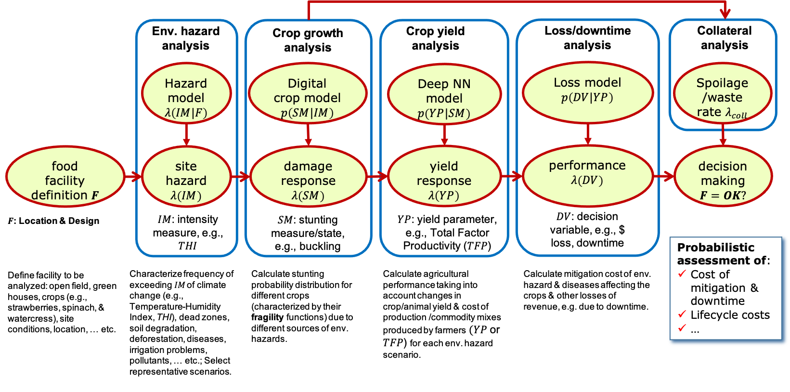
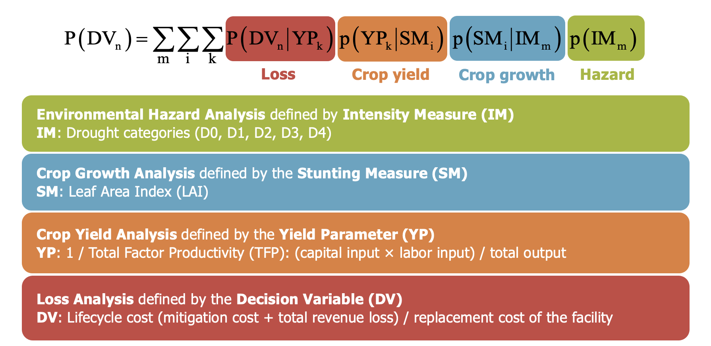
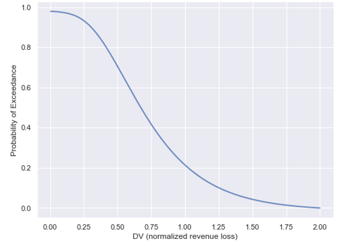

# PBFE 

## Overview

### Introduction

PBFE stands for [Performance Based Engineering for Resilient Food Industry](https://food-manufacturing.berkeley.edu/performance-based-eng-for-resilient-food-ind/). We aim at developing a food system management framework by combining Performance Based Engineering (PBE) and Artificial Intelligence (AI), to increase the efficiency, safety & resilience of agricultural production by improving food yield in terms of both quantity and quality, controlling crop diseases, decreasing resource consumption & waste, and increasing traceability. Traditionally, agricultural management is based on empirical judgement resulting from experiments & experience, which is no longer adequate because of increased complexity and added uncertainty of food systems due to the increasing demands of the world population. Thus, uncertainty quantification in food systems has been recently adopted. However, a robust framework is still lacking and this project aims at filling this gap.

*Figure 1. Overview of the PBFE framework.*

<!--- Everything Here Will Be Commented OUT --->
<!---  --->

  

### Results

PBFE consists of four phases (environmental hazard analysis, crop growth analysis, crop yield analysis and loss analysis) and uses the total probability theorem to compute the loss curve which represents the Probability of Exceedance (POE) of different values of a Decision Variable (DV). We developed the *Python* script for implementing the PBFE methodology, where the selections of the variables in each phase are shown in Figure 2.

<!--- $$P(DV_n) = \sum\limits_m \sum\limits_i \sum\limits_k P(DV_n | YP_k) p(YP_k | SM_i) p(SM_i | IM_m) p(IM_m)$$ --->

*Figure 2. PBFE formulation and variable selections.*

<!---  --->

  

A branch graph (Figure 3) can be used to visualize the computations and to clarify the formulation and the numerical process. Since currently there is not sufficient data to quantify the probabilities, the developed script used some hypothetical values for each phase, resulting in the loss curve shown in Figure 4 as a demonstrative application.

*Figure 3. Branch graph for the formulation process visualization.*

<!---  --->

  

*Figure 4. Example loss curve obtained by the PBFE methodology.*

<!---  --->

  

We selected *drought* as the environmental hazard variable in phase 1. For environmental hazard analysis, we collected weather data in California and developed a decision tree and a random forest model for drought classifications (D0, D1, D2, D3, & D4). The details and results can be found in the [./scripts/drought](https://github.com/hufanyoung/PBFE/tree/main/scripts/drought) folder. 

## Usage

### Setup

Mention the environment the code was run on during development and testing as well as any dependencies that are needed.

### Running

Explain in detailed steps how to run the code in order to reproduce the results shown above in the results section.

#### Step 1.

Download all the input data.

#### Step 2.

Generate the values for training the model.

#### Step 3.

Train the model.

## Authors

* Khalid M. Mosalam1,2,3
* Fan Hu1,3

1. Department of Civil and Environmental Engineering, University of California at Berkeley
2. Pacific Earthquake Engineering Research (PEER) Center, University of California at Davis
3. USDA/NSF AI Institute for Next Generation Food Systems (AIFS)

## Contact

For any questions, please contact us at mosalam@berkeley.edu.

## Citation

Citation will be updated later.

## License

This project is licensed under the [Name of license]. Please see the [LICENSE](https://github.com/AI-Institute-Food-Systems/aifs-github-best-practices/blob/main/LICENSE) file for details.

## Acknowledgements

Acknowledgements will be updated later.

## Funding

* USDA-NIFA AI Institute for Next Generation Food Systems (AIFS), USDA-NIFA award number 2020-67021-32855.
