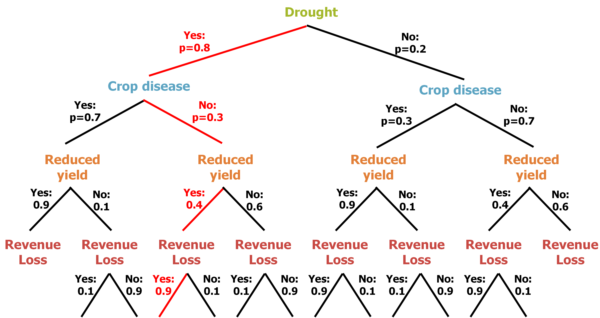

# PBFE 

## Overview

### Introduction

PBFE stands for [Performance Based Engineering for Resilient Food Industry](https://food-manufacturing.berkeley.edu/performance-based-eng-for-resilient-food-ind/). We aim at developing a food system management framework by combining Performance Based Engineering (PBE) and Artificial Intelligence (AI), to increase the efficiency, safety & resilience of agricultural production by improving food yield in terms of both quantity and quality, controlling crop diseases, decreasing resource consumption & waste, and increasing traceability. Traditionally, agricultural management is based on empirical judgement resulting from experiments & experience, which is no longer adequate because of increased complexity and added uncertainty of food systems due to the increasing demands of the world population. Thus, uncertainty quantification in food systems has been recently adopted. However, a robust framework is still lacking and this project aims at filling this gap.

*Figure 1. Overview of the PBFE framework.*

### Results

We developed the *Python* script for implementing the PBFE methodology by choosing the variables in the four phases. 

*Figure 2. Branch graph for the formulation process visualization.*

## Usage

### Setup

Mention the environment the code was run on during development and testing as well as any dependencies that are needed.

### Running

Explain in detailed steps how to run the code in order to reproduce the results shown above in the results section.

#### Step 1.

Download all the input data.

#### Step 2.

Generate the values for training the model.

#### Step 3.

Train the model.

## Authors

* Khalid M. Mosalam1,2,3
* Fan Hu1,3

1. Department of Civil and Environmental Engineering, University of California at Berkeley
2. Pacific Earthquake Engineering Research (PEER) Center, University of California at Davis
3. USDA/NSF AI Institute for Next Generation Food Systems (AIFS)

## Contact

For any questions, please contact us at mosalam@berkeley.edu.

## Citation

Citation will be updated later.

## License

This project is licensed under the [Name of license]. Please see the [LICENSE](https://github.com/AI-Institute-Food-Systems/aifs-github-best-practices/blob/main/LICENSE) file for details.

## Acknowledgements

We would like to extend our heartfelt thanks to the following individuals who have contributed to this project.

- [Full Name](https://github.com/username)
- [Full Name](https://github.com/username)
- ...

In addition to the contributors listed above, we would like to recognize the exceptional contributions of the following individuals:

- [Full Name](https://github.com/username) - For significant contributions or leadership.
- [Full Name](https://github.com/username) - For valuable contributions and ongoing support.
- ...

## Funding

* USDA-NIFA AI Institute for Next Generation Food Systems (AIFS), USDA-NIFA award number 2020-67021-32855.
